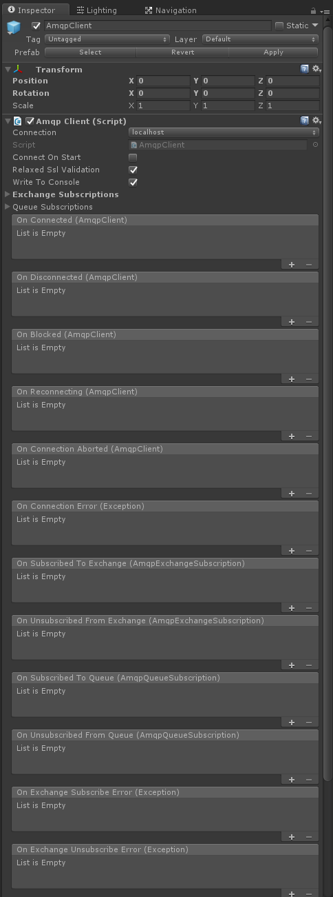

# Unity3D.Amqp
**AMQP client library for Unity 3D supporting RabbitMQ**

This is a Unity 3D package and set of source files that allows the ability to use [AMQP](http://www.amqp.org/) within Unity 3D projects. For now the initial support will be solely based around the [.NET RabbitMQ client](http://www.rabbitmq.com/dotnet.html).

Attempts to track down other integrations of AMQP clients into Unity 3D all came up short so this project was created to provide a straight-forward integration. Trying to integrate the official .NET RabbitMQ client proved to be rather cumbersome and had several large roadblocks. This project exists in a state where it is possible to compile a working version of the RabbitMQ client library and a Unity asset package that can be imported into other Unity projects.

**Note:** This project is very new so the documentation will probably be a bit sparse until there is more time to build it up. The project will also be constantly adding features and may including breaking changes. The code is fairly well documented however so if you feel like just diving in and trying to make sense of it - go for it! It will still be easier than trying from scratch to get AMQP support in Unity.

This project offers the following:
* A Unity asset package that can be imported into Unity projects made with Unity 5.x+ that provides easy AMQP client integration (tested with Windows, macOS, and Android builds so far, Linux will likely work too, iOS planned)
* A custom .NET library that wraps the RabbitMQ client and provides extensibility for integrating other AMQP clients beyond RabbitMQ .NET if necessary
* A thread-safe pattern that plays nice with Unity's game thread (out of the box the .NET RabbitMQ client cannot directly interact with Unity's game thread)
* Unity C# source files that provide Unity-specific classes and MonoBehaviour scripts for working with AMQP including a useful diagnostics console
* A working version of the .NET RabbitMQ client version 3.4.4 that builds with Visual Studio 2015 (this is actually important, read on to find out why)

## Table of Contents

- [Introduction](#introduction)
  - [Background](#background)
  - [AMQP and Unity](#amqp-and-unity)
- [Installation](#installation)
- [Quick Start](#quick-start)
- [Thread Safety](#thread-safety)
- [SSL Support](#ssl-support)
- [Compatibility](#compatibility)
  - [.NET RabbitMQ client 3.4.4](#net-rabbitmq-client-344)
  - [Unity 3D Build Support](#unity-3d-build-support)
- [License](#license)

## Introduction

If you have made your way to this repository then you likely already know what [AMQP](http://www.amqp.org/) and [RabbitMQ](http://www.rabbitmq.com/) are and are simply looking to integrate an AMQP client into your [Unity 3D](https://unity3d.com/) project/game.

### Background

If you are not familiar with the AMQP protocol, the RabbitMQ message server and client, what messaging queuing is, or what a message bus is then a small introduction might be useful. The [tutorials](http://www.rabbitmq.com/getstarted.html) section of the RabbitMQ website is a good starting place to learn some of the patterns through examples.

In simple terms AMQP is a messaging protocol used for [message queuing](https://en.wikipedia.org/wiki/Message_queue) and RabbitMQ is an client and server implementation of the AMQP protocol. You can think of email as a form of message queuing although it tends to be a lot more user/content focused and not as realtime-oriented as a protocol like AMQP. The basic idea is that clients send messages to a server (usually called a 'message broker' or just 'broker') which are published to a specific address (called an 'exchange' or 'queue') where they become available to be read (or 'consumed') by other clients. Unlike email, however, AMQP is much more focused on lightweight, realtime messages with arbitrary content defined by the application. It also shares a few similarities to HTTP such as configurable message headers.

One of the main attractions to protocols like AMQP is the ability to implement useful messaging patterns such as [publish/subscribe](https://en.wikipedia.org/wiki/Publish%E2%80%93subscribe_pattern) and [work queues](https://www.rabbitmq.com/tutorials/tutorial-two-dotnet.html). Typically messages are published to exchanges on the server (sort of like email addresses) where they are then distributed to one or more message queues. Queues hold a copy of each message and the messages will wait in the queue in the order they were received until they are consumed and read by a client. Often there will be a unique queue per client which means that different clients can consume their own copy of the messages at different rates without affecting each other. Messages can be persisted to disk or just stored in memory. There are also advanced message routing capabilities for pattern-based routing using routing keys and other mechanisms.

RabbitMQ is just one of many implementations of the AMQP protocol. It is a very mature and well documented open source implementation that is used by countless companies and projects to implement high-performance message routing systems.

### AMQP and Unity

Since Unity is built on Mono and supports .NET sockets as well as several network multiplayer options you might be asking what the point of using AMQP with Unity is. The most obvious answer is that you may want to connect Unity to existing AMQP systems.

Writing your own TCP/UDP messaging system with .NET sockets is not a small undertaking. You will quickly find yourself reinventing the wheel at which point considering a technology like AMQP is a good choice. It has a considerable world-wide development effort behind it and used in many demanding commercial scenarios where realtime messaging is a critical component.

Unity does have several network multiplayer options but these aren't always well suited for some of the messaging design patterns you might want to use in your project or game. For example you might want to create chat functionality (publish/subscribe pattern) that doesn't require players to start a network game session before they can chat with one another. Creating work queues where non-Unity services consume tasks and perform work (with the ability to ensure a work item is not lost if a worker crahses while performing the work) is another example.

Unity's built-in network multiplayer system does not offer very sophisticated message routing options either, although it has some strengths that AMQP does not.

## Installation

Currently you should build locally by downloading the source or cloning the repository. To build, you will need [Visual Studio 2015](https://www.visualstudio.com/downloads/). Building with Mono might be possible with additional steps but that hasn't been attempted yet.

**Note:** If you don't need to build the project from source you can just use the asset package directly in your Unity project. See the [Quick Start](#quick-start) section for details.

## Quick Start

The fastest way to get up and running with AMQP in your Unity project is to just import the asset package. You can find the asset package in this project here: **/unity/CymaticLabsUnityAmqp.unitypackage**.

**Note:** If you don't want to download the whole project and just want to work with the asset package you can download it from the [releases section](https://github.com/CymaticLabs/Unity3D.Amqp/releases) of the project.

Start a new project or open a project you'd like to import the library into. Once you've done that import **CymaticLabsUnityAmqp.unitypacakge** into your project:


Once the asset package has been imported, locate and load the **AmqpDemo** scene:


Before you can use the library you will need to do an initial setup of the AMQP configuration. To do this, open the AMQP configuration editor window:


The AMQP configuration editor window is where you will configure the AMQP connections that your Unity project will use. Opening the editor for the first time will create a text asset configuration file that will be used by the project. By default it contains a single connection which is configured for the default install of [RabbitMQ server](http://www.rabbitmq.com/download.html) running on localhost which is useful for local development and testing.

**Note:** The this library pertains to RabbitMQ servers specifically. Your mileage may vary with other AMQP servers/brokers. The Web Port and exchange/queue descovery methods are specifically implemented for RabbitMQ servers and will probably fail with other hosts.


Ensure that you see the AMQP configuration file created by the editor. You can edit this file manually if that's easier for some reason, but it is recommended you use the AMQP configuration editor window instead. Connections must have a unique name so if you edit the file by hand keep that in mind. The configuration file should live in **Assets/Resources** in your project. The file provides a convenient way to transfer commonly used connections between multiple Unity projects by copying and pasting the file from one project to another.


Assuming you have installed RabbitMQ server locally with the default settings you can now play the demo scene and you should see a single connection in the Conneciton drop down to the left of the demo scene's UI. Press the **Connect** button to connect to your local RabbitMQ server.


To test a basic "echo" scenario to ensure messages are flowing between Unity and RabbitMQ server subscribe to an exchange in the Subscriptions section of the form. Select **"amq.topic"** and leave the routing key blank, then hit the **Subscribe** button.

After you have subscribed, select the same **"amq.topic"** in the **Publish** area drop down. Leave the routing key blank, type a text message to send in the **Message** text input, and then hit the **Send** button. You should see your message echoed back in the demo scene's console below.


To add or update connections open the AMQP configuration editor window again.

* To update a connection, leave its name the same but update its connection details and then hit the **Save** button
* To add a new connection, just ensure you give it a unique name in the connection details form, then hit the **Save** button; it should now appear in the **Connection** drop downs and in the configuration file
* To delete a connection, select it from the editor's drop down and press the **Delete** button

In the following example we add new connection to [CloudAMQP](https://www.cloudamqp.com/) who offer a free tier of hosted RabbitMQ server:


The following is an explaination of a connection's properties:

* **Host** - The host address of the AMQP server to connect to
* **Amqp Port** - The AMQP protocol port number on the host to connect to (5672 is default unencrypted, 5671 is default encrypted)
* **Web Port** - The web port number on the host to connect to that is used for exchange/queue discovery (for local RabbitMQ server 15672 is default, 80 is default for unencrypted, and 443 is default for encrypted) 
* **Virtual Host** - The [RabbitMQ virtual host ](https://www.rabbitmq.com/vhosts.html) to connect to
* **Username** - The client username to use when connecting to the AMQP server
* **Password** - The client password to use when connecting to the AMQP server
* **Reconnect Interval** - The number of seconds to wait inbetween connection retries when the connection to the server fails (1 second minimum)

Once you've added an additional connection it should show up in the demo scene's drop down when you play it and you should be able to connect to the new server instead of your localhost:


**Note:** If you are attempting to connect to a hosted RabbitMQ server like CloudAMQP keep in mind the **AMQP Port** and **Web Port** configuration will matter. For example CloudAMQP supports both 5672 (unencrypted) and 5671 (encrypted) for AMQP but only 443 (encrypted) for HTTP/web communication. If you need to use encrypted communication you should read about [SSL support](#ssl-support).

Finally, find the **AmqpClient** game object in the demo scene and familiarize yourself with the **AmqpClient.cs** script. This MonoBehaviour is the main way to interface with an AMQP broker from Unity. It exposes events and methods for connecting, disconnecting, subscribing, and publishing to an AMQP broker. If you only need a single broker connection it has convenient static methods or you can create multiple instances for multiple connections.

You can look for the **AmqpClient** prefab or just drag the script onto a GameObject in your scene. Here's what it looks like in the inspector:



Here's a quick description of the script's inspector properties:

* **Connection** - The AMQP connection to use that was configured with the AMQP configuration editor
* **Connect On Start** - When enabled the script will attempt to establish a connection to the AMQP server on Start()
* **Relaxed Ssl Validation** - When enabled SSL certificate validation from the AMQP server will be relaxed ([see details](#ssl-support))
* **Write To Console** - When enabled important AMQP log details will be written to the included AmqpConsole class/prefab (optional)
* **Requested Heart Beat** - The number of seconds of the requested connection keep-alive heart beat.
* **Exchange Subscriptions** - A list of exchange subscriptions that the client will subscribe to upon successful connection (make sure they are enabled and that you select the correct exchange type)
* **Queue Subscriptions** - A list of direct queue subscriptions that the client will subscribe to upon successful connection (make sure they are enabled)

Events:

* **On Connected** - Occurs when the client successfully connects to the server
* **On Disconnected** - Occurs when the client disconnects from the server
* **On Blocked** - Occurs if the client is blocked by the server
* **On Reconnecting** - Occurs each reconnection attempt made by the client when a connection becomes unavailable
* **On Connection Error** - Occurs when the client experiences a connection error
* **On Subscribed To Exchange** - Occurs when the client successfully subscribes to an exchange
* **On Unsubscribed From Exchange** - Occurs when the client successfully unsubscribes from an exchange
* **On Subscribed To Queue** - Occurs when the client successfully subscribes to a queue
* **On Unsubscribed From Queue** - Occurs when the client successfully unsubscribes from a queue

## Thread Safety

Unity's main game thread cannot directly interact with the thread(s) that the AMQP messaging functions occur on. If you try to call UnityEngine code directly from events that occur in the underlying AMQP client you will likely experience unhandled exceptions telling you such interactions are not allowed. The **AmqpClient** class (which subclasses MonoBehaviour) implements a thread-safe pattern. Within the **AmqpClient** class, client connection events (such as connect, disconnect, reconnect, blocked, subscribed, etc.) and received message events are quickly queued in thread-safe variables and then processed on the **Update()** method of **AmqpClient** to allow safe interaction with Unity's main game thread. Be aware of this limitation when working with this library.

## SSL Support

SSL is supported with the AMQP client but there are several issues you will need to be aware of. Since Unity uses [Mono](http://www.mono-project.com/) you should be aware of [Mono's SSL/TLS support](http://www.mono-project.com/docs/faq/security/) as well as what it means for [RabbitMQ compatibility](https://www.rabbitmq.com/ssl.html#configuring-dotnet). Further compounding the issue is the fact that [Unity uses a forked version of Mono that tends to run way behind the latest code](http://answers.unity3d.com/questions/50013/httpwebrequestgetrequeststream-https-certificate-e.html). If you plan on working with SSL for secure AMQPS communication or HTTPS (used for some RabbitMQ broker REST API interaction) then you should try to familiarize yourself with the details.

**Note:** If you want to use encrypted communications but certificate verification is not your ultimate concern then you can enable relaxed SSL verification by setting the **RelxaedSslVerficiation** Unity inspector property of AmqpClient to **True**. Or you can set it from code:

```cs
CymaticLabs.Unity3D.Amqp.SslHelper.RelaxedValidation = true;
```

Keep in mind that this is a global setting that **will relax all SSL certificate validation within the execution of your Unity project**. It is an easy way to enable encrypted communication **but not verifying the trust of an SSL certificate is a security concern and you should understand the implications of applying this setting**.

That said not verifying an SSL certificate but still using SSL for communication is still theoretically better than not using encrypted communication at all. If verifying the trust of an SSL certificate is important to you then you will need to add the trusted certificates to Mono's trust store (which is separate than Window's native trust store). You may consider using the [mozroots.exe tool](http://answers.unity3d.com/questions/792342/how-to-validate-ssl-certificates-when-using-httpwe.html).

## Compatibility

### .NET RabbitMQ client 3.4.4

Quite a few issues exist when attempting to integrate AMQP with Unity, specifically with the official .NET RabbitMQ client. Since Unity  (as of version 5.5.1) still only supports .NET Framework 3.5 that means that a specific version of the .NET RabbitMQ client must be used. The last version to support .NET 3.5 is version 3.4.4 of the RabbitMQ client. Any version greather than 3.4.4 is not compatible with Unity.

Building version 3.4.4 has a few issues. It's an archived version at this point so first you must track it down in the official git repository for the client. Also it was built with Visual Studio 2008 and when opening the project in Visual Studio 2015 the upgrade fails with errors. The [build instructions](http://www.rabbitmq.com/build-dotnet-client.html) on RabbitMQ's offical website are no longer accurate to version 3.4.4 and it was difficult to track them down. The [internet archive](https://archive.org/) fortunately yielded a page with build instructions.

The version of the RabbitMQ client library that is in the **/lib** folder of this project has already been upgraded and will open and build properly in Visual Studio 2015.

The **CymaticLabs.Unity3D.Amqp** project references the local 3.4.4 client projects directly. This is useful if you need to debug the RabbitMQ client library itself (including break points). Also there seems to be no official nuget package for 3.4.4, only 3.4.3 and 3.5.0; so this project includes the additional bug fixes of 3.4.4.

### Unity 3D Build Support

This library has been successfully tested for the follow platforms/builds:

* Windows 10 (native, not UWP - UWP will likely not work without modification)
* macOS El Capitan
* Android 7.0

This library is likely compatible with other versions of Windows, macOS, and Android, but they just hasn't been tested yet. Linux and iOS might work as well but also have not been tested (if you end up trying and it works, please let me know). Since macOS with Mono works, it is likely that Linux builds will work without any modification.

iOS support is definitely on the roadmap. Hopefully things will work as-is when it comes time to test, but if not there at least some clues that provide hope it should be possible. [This post about Xamarin integration](https://forums.xamarin.com/discussion/49858/using-rabbitmq-amqp-with-xamarin-forms) hints it should work.

## License

Code and documentation are available according to the *MIT* License (see [LICENSE](https://github.com/CymaticLabs/Unity3D.Amqp/blob/master/LICENSE)).
